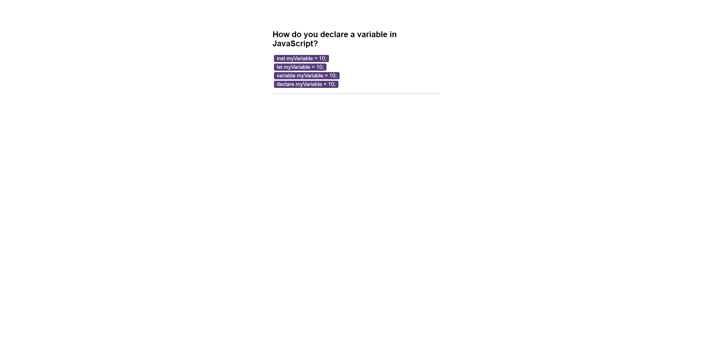

# Code Quiz

## Description

Code Quiz website with 10 questions per quiz. Users can interact with the website by starting a new quiz, answering questions against time, earning a score and saving it in a highscores list.

## Table of Contents

* [Installation](#installation)
* [Usage](#usage)
* [Credits](#credits)
* [License](#license)
* [Badges](#badges)

## Installation

N/A

## Usage 

Go To: [codrincarpovici.github.io/code-quiz/](https://codrincarpovici.github.io/code-quiz/) and view the website. 

Once on the website click on the start quiz button. You will then be given a series of questions against a set amount of time displayed in the upper right corner. On a wrong answer, 10 seconds get deducted from the total. On a right answer you earn 10 points for your score. When an answer is selected a new question will appear, until you reach 10 questions or run out of time, at which point the quiz will end. After the quiz has ended you will be prompted to insert your initials to save your score and then the highscores leaderboard will display. From here you can choose to go back and play another quiz or to clear all highscores from the list. You also have the option of clicking on View Highscores in the top left to check the highscores from the home page.

## Credits

Used as inspiration to make JavaScripts Questions array:\
Banescripts 2023, Laurence Svekis, Online Teacher, accessed on the 1st and 5th of December 2023, <https://basescripts.com/110-javascript-quiz-questions-with-solutions-pdf-download-test-your-knowledge>.

## License

## Badges

